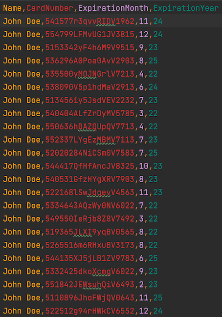
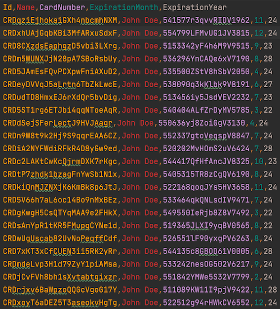
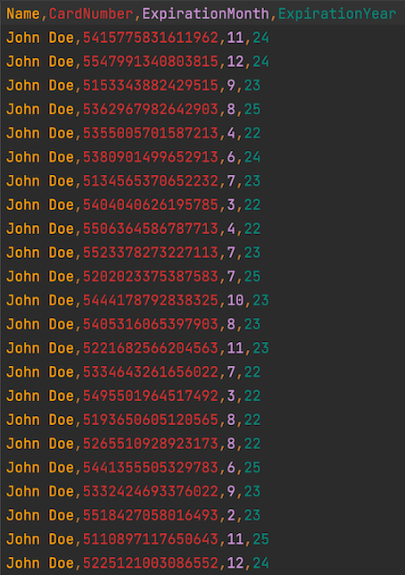

<p align="center"><a href="https://www.verygoodsecurity.com/"></a></p>
<p align="center"><b>CALM Bulk Enrollment Sample</b></p>


[](https://circleci.com/gh/vgs-samples/calm-one-time-enrollment/tree/main)


### Environment

Sample is running on Sandbox by default. In order to run on Live environment specify value of `live` for `ENVIRONMENT` environment variable.

### Enrollment of VGS aliased card data

To send VGS aliases directly to CALM API you need to perform the following steps.

#### Pre-requisites
1. In your existing VGS Vault (where you store card data) you need to configure an outbound route for sending data to CALM API. There are two ways to do it:
   1. Go to [Vault Dashboard](https://dashboard.verygoodsecurity.com/). Select your vault -> Routes -> Add Route (From YAML file) -> Add `routes/calm_outbound.yaml` route.
   1. Using [VGS CLI](https://www.verygoodsecurity.com/docs/vgs-cli/getting-started): `vgs apply routes --vault <VAULT_ID> -f routes/calm_outbound.yaml` where `<VAULT_ID>` corresponds to your vault id in which you store card data. 
1. Generate [Vault Credentials](https://www.verygoodsecurity.com/docs/settings/access-credentials#generating-new-credentials) on [Vault Dashboard](https://dashboard.verygoodsecurity.com/) and save them. 
1. Generate [CALM API Credentials](https://www.verygoodsecurity.com/docs/payment-optimization/calm/api/authentication#api-credentials) and save them.
1. Run [Docker daemon](https://docs.docker.com/get-started/overview/).

#### Prepare card data

`csv/aliased_cards.csv` file should contain cardholder name, card number aliases from your existing vault, expiration month and expiration year of the card (you can adjust the sample code to contain billing address too according to our [API Reference](https://www.verygoodsecurity.com/docs/account-updater/api)).


##### Testing on sample data 

For testing purposes you can use new sandbox vault and redact testing card numbers data. To do it 
- Add `alias_inbound.yaml` route to your vault following steps in "Pre-requisites" section.
- Run sample in [Docker](https://www.docker.com/) replacing `<VAULT_ID>` with your test vault id (or change it in `docker-compose.yaml`):
  - `docker compose build`
  - `VAULT_ID='<VAULT_ID>' docker compose run alias-test-cards`

#### Perform Bulk Enrollment

To start enrollment process of cards in `csv/aliased_cards.csv` file use values from "Pre-requisites" step 2 and 3. In command below:
   1. Replace `<VAULT_ID>` with your test vault id.
   1. Replace `<VAULT_USERNAME>` and `<VAULT_PASSWORD>` with your vault username and password from "Pre-requisites" step 2.
   1. Replace `<CALM_CLIENT_ID>` and `<CALM_CLIENT_SECRET>` with API credentials client id and secret values from "Pre-requisites" step 3.

Run:

```bash
VAULT_ID='<VAULT_ID>' \
VAULT_USERNAME='<VAULT_USERNAME>' \
VAULT_PASSWORD='<VAULT_PASSWORD>' \
CALM_CLIENT_ID='<CALM_CLIENT_ID>' \
CALM_CLIENT_SECRET='<CALM_CLIENT_SECRET>' \
docker compose run bulk-aliases-enrollment
```
As a result you will get aliased updated cards:



### Enrollment of raw card data

#### Pre-requisites

1. Create vault on [Vault Dashboard](https://dashboard.verygoodsecurity.com/).
1. Use Vault ID to generate [CALM API Credentials](https://www.verygoodsecurity.com/docs/payment-optimization/calm/api/authentication#api-credentials) and save them.
1. Run [Docker daemon](https://docs.docker.com/get-started/overview/).

#### Prepare card data

Add your card data to `csv/card_numbers.csv` file according to its format.



#### Perform Bulk Enrollment

To start enrollment process of cards in `csv/card_numbers.csv` file use values from "Pre-requisites" step 2 and 
replace `<CALM_CLIENT_ID>` and `<CALM_CLIENT_SECRET>` with API credentials client id and secret values.

Run:

```bash
CALM_CLIENT_ID='<CALM_CLIENT_ID>' \
CALM_CLIENT_SECRET='<CALM_CLIENT_SECRET>' \
docker compose run bulk-raw-enrollment
```

## Next Steps
After enrolling your cards, you can get updated cards with synchronous [pull](https://www.verygoodsecurity.com/docs/payment-optimization/calm/account-updater#pull-updates) or asynchronous [push](https://www.verygoodsecurity.com/docs/payment-optimization/calm/account-updater#push-updates) model.

